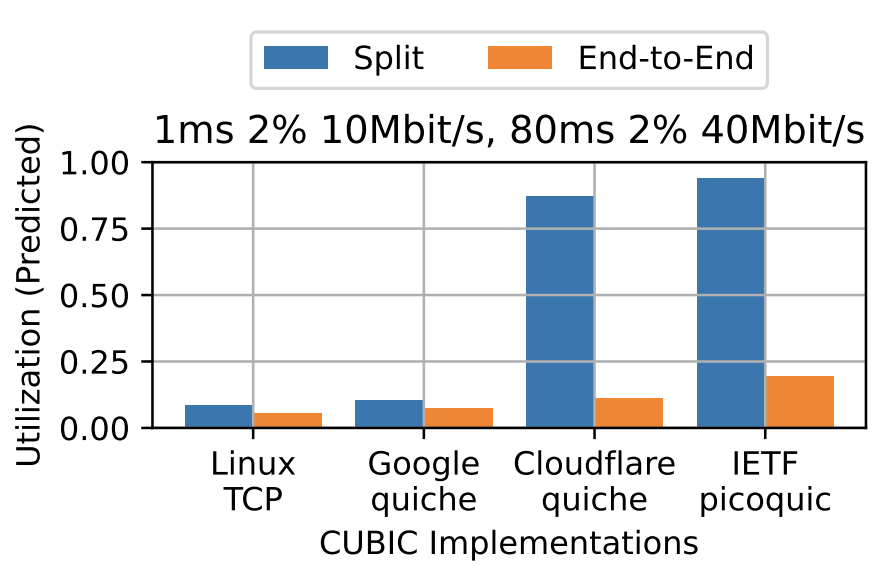
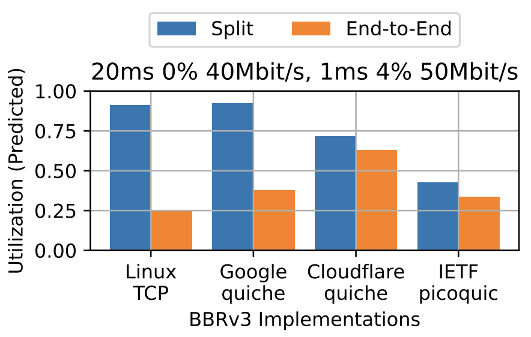
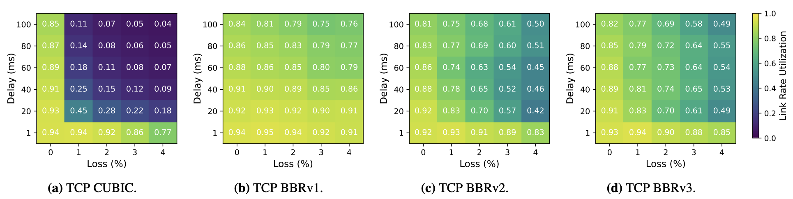

# Internet Connection Splitting: What's Old is New Again

This repository contains the artifact for the USENIX ATC '25 paper "Internet
Connection Splitting: What's Old is New Again" by [Gina Yuan](https://www.ginayuan.com),
[Thea Rossman](https://profiles.stanford.edu/thea-rossman), and
[Keith Winstein](https://cs.stanford.edu/~keithw/) from Stanford University.
The artifact consists of all the raw data from the paper, Jupyter notebooks for
analyzing and plotting this data using the _split throughput heuristic_, and
scripts for automating data collection for replicating the emulation
experiments.

## Getting Started

To get started with this artifact, we recommend exploring the Jupyter notebooks
using the raw data. For further exploration, we then recommend running
emulations and replicating some of the results of the emulation throughput
experiments, or even evaluating your own congestion control schemes.

### Setup

All experiments were run on CloudLab x86_64 `rs630` nodes in the Massachusetts
cluster, using Ubuntu 22.04. Any similar Linux x86_64 machine would suffice.
Clone this repository into your home directory. Install dependencies, accepting
any prompts:

```
./deps/node0.sh
```

The instructions assume your working directory is `~/connection-splitting`.
The Jupyter notebooks read and write raw data to `~/connection-splitting/data`.
Initialize this directory with raw data:

```
tar xvf 2025-01-15-data.tar.gz
```

Follow the instructions in [`notebook/`](https://github.com/StanfordSNR/connection-splitting/tree/main/notebook)
to setup your Python kernel and access the notebook from your local machine.

### Explore notebooks

Confirm that you are able to execute all (non-hidden) cells in the following
notebooks to regenerate the figures and analysis in the paper:

* `parameter_exploration.ipynb`
	* Figure 4: Characterize TCP congestion control schemes at 10 Mbit/s.
	* Figure 5: Characterize QUIC congestion control schemes at 10 Mbit/s.
	* Figures 8-12 in the Appendix: Heatmaps of the full parameter space.
* `network_path_analysis.ipynb`
	* Table 3: Apply the heuristic to analyze TCP in theoretical split settings - ***FINDING 2***.
	* Figure 1 (heuristic only): Identify marquee network settings for Figure 1 - ***FINDING 1***.
	* Figure 6: Apply the heuristic to reason about QUIC in split settings - ***FINDING 3***.
* `network_path_real_data.ipynb` (optional)
	* Figure 1: Marquee network settings where TCP BBRv3 benefits significantly
	  from a real connection-splitting PEP but TCP BBRv1 does not.
* `accuracy_analysis.ipynb` (optional)
	* Figure 7: Heatmaps comparing measured and predicted split throughputs.

The `network_path_analysis.ipynb` notebook relies purely on cached data to apply
the split throughput heuristic. Feel free to analyze this data more yourself!

For further exploration, follow the detailed instructions below for how to
replicate the emulation experiments.

<p align="center">
	
	
	<br>
	<b>Figure 6:</b> The predicted behavior of each CCA based on end-to-end
	behavior varies significantly by implementation.
</p>

## Detailed Instructions

The measurement study consists of two parts:

1. Characterize various congestion control schemes in a wide parameter space of
_end-to-end_ network settings.
2. Apply the split throughput heuristic to analyze these congestion control
schemes in various _split_ network settings.

The "Getting Started" instructions describe Part 2, and in this section we
describe how to run the emulations for Part 1. The experiments also run
emulations with a real TCP PEP to evaluate the accuracy of the heuristic.

### Run a single emulation

These instructions assume you have followed the setup instructions in "Getting
Started" above. No more dependencies are needed unless you wish to evaluate TCP
BBRv2/3 (which require separate kernels) or Google QUIC (which uses up a lot
of disk space). However, instructions for installing these are available in
[`deps/`](https://github.com/StanfordSNR/connection-splitting/tree/main/deps).

Follow the "Example" instructions in [`emulation/`](https://github.com/StanfordSNR/connection-splitting/tree/main/emulation)
to a run a single emulation. The default network configuration has loss on the
path segment near the client who makes the HTTPS GET request.

### Collect heatmap data

First, delete or move the `~/connection-splitting/data`
directory so the notebooks don't rely on the cached data. If a notebook cell
states that data is missing without running the emulation, change the
`execute=False` argument to `True`. Note that TCP BBRv2 and TCP BBRv3 require
that you are on the correct Linux kernel!

Collect heatmap data for a few congestion control schemes in
`parameter_exploration.ipynb` such as TCP BBRv1, picoquic BBRv3, Cloudflare
CUBIC, etc. We recommend changing the configurations in the third cell to the
following to run fewer trials while still getting a basic idea of the heatmap:

```
NUM_TRIALS = 1
PDF = False
LOSSES = [0, 1, 2, 3, 4]
DELAYS = [1, 20, 40, 60, 80, 100]
BWS = [10]
```

Each heatmap takes up to a few hours to collect with one trial. You can
interrupt the process, change `execute=True` to `False`, and execute the cell
to visualize intermediate progress. As long as you started the Jupyter notebook
in a detached shell like `tmux`, you can leave the process running in the
background.

<p align="center">
	
	<br>
	<b>Figure 4:</b> Link rate utilization heatmaps at 10 Mbit/s.
</p>

### TCP PEP experiments (optional)

To replicate the remaining figures, similarly re-execute the cells in
`network_path_real_data.ipynb` and `accuracy_analysis.ipynb` after moving
the cached data and changing `execute=False` to `True`. For the paper, we
executed TCP BBRv2 and TCP BBRv3 benchmarks on different nodes and rsynced
the data directories.

## Acknowledgments

This work was supported in part by NSF grants 2045714 and 2039070, DARPA
contract HR001120C0107, a Stanford School of Engineering Fellowship, a Sloan
Research Fellowship, affiliate members and other supporters of Stanford DAWN,
including Meta, Google, and VMware, as well as Cisco and SAP, and Huawei,
Dropbox, Amazon, and the Mozilla Foundation. Any opinions, findings, and
conclusions or recommendations expressed in this material are those of the
authors and do not necessarily reflect the views of the sponsors.
